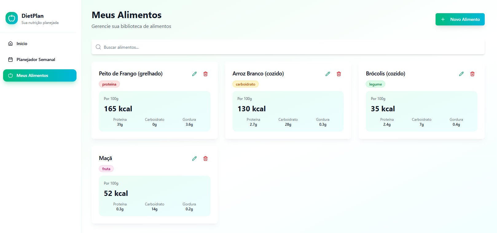

# NutriPlanner 🍏 - Seu Planejador de Dietas Pessoal

NutriPlanner é uma aplicação web moderna construída para ajudar usuários a planejar suas refeições semanais, gerenciar uma biblioteca de alimentos e acompanhar suas metas nutricionais de forma visual e intuitiva.

  

---

## ✨ Principais Funcionalidades

- **Dashboard Nutricional**  
  Tenha uma visão geral e clara do seu consumo semanal de calorias, proteínas, carboidratos e gorduras com cards interativos.

- **Planejador Semanal**  
  Uma grade visual da sua semana onde você pode adicionar, editar e remover refeições para cada dia (café da manhã, almoço, jantar, etc.).

- **Biblioteca de Alimentos**  
  Crie e gerencie sua própria lista de alimentos, especificando informações nutricionais detalhadas para cada um.

---

## 🚀 Como Rodar o Projeto Localmente

### 📋 Pré-requisitos

- **Node.js** (versão 18 ou superior). [Baixar aqui](https://nodejs.org)  
- **npm** (já incluso no Node.js) ou **yarn**

### ⚡ Passo a Passo

### 1. **Clone o Repositório**

   ```bash
   git clone https://github.com/seu-usuario/nutriplanner-app.git
   ```

### 2. Navegue até a Pasta do Projeto e Compile
  
  ```bash
  cd nutriplanner-app

  npm install

  npm run dev
  ```

Abra no Navegador
Acesse o endereço exibido no terminal:

👉 http://localhost:5173

## 🛠️ Tecnologias Utilizadas

Frontend: React.js
Build Tool: Vite - um ambiente de desenvolvimento extremamente rápido.
Estilização: Tailwind CSS - um framework de CSS utility-first para design rápido e responsivo.
Componentes de UI: Shadcn/UI - coleção de componentes reutilizáveis e acessíveis.
Ícones: Lucide React
Animações: Framer Motion

## 📈 Próximos Passos e Evolução do Projeto

Atualmente, o NutriPlanner funciona com dados simulados (armazenados localmente no navegador). Estes são os principais pontos para transformar o projeto em uma aplicação completa:

🔹 Conectar a um Backend Real

O Quê? Substituir a camada de dados simulada que está em src/entities/all.js.

Como? Utilizar serviços como Firebase (Firestore) ou Supabase para ter um banco de dados real na nuvem com autenticação. Isso permitirá salvar os dados do usuário de forma permanente.

🔹 Autenticação de Usuários

O Quê? Implementar sistema de login e cadastro para que cada usuário tenha seu próprio planejamento.

Como? Usar Firebase Authentication, Supabase Auth ou Clerk para simplificar o processo.

🔹 Definição de Metas Nutricionais

O Quê? Permitir que o usuário defina metas diárias/semanais (ex: 2000 kcal, 120g de proteína).

Como? Criar uma nova página de Configurações/Perfil e armazenar essas metas no banco de dados. O Dashboard então exibirá o progresso em relação às metas.

🔹 Criação de Receitas

O Quê? Possibilitar que o usuário agrupe vários alimentos em uma Receita para facilitar a adição no planejador.

Como? Criar uma nova entidade/tabela Recipes no banco de dados, relacionada com a entidade Food.

🔹 Geração de Lista de Compras

O Quê? Gerar automaticamente uma lista de compras com base no planejamento semanal.

Como? Criar uma função que percorra todas as refeições da semana, some as quantidades de cada alimento e apresente em uma lista organizada.

## 📌 Contribuições

Contribuições são muito bem-vindas!
Abra uma issue ou envie um pull request com melhorias, correções ou novas ideias.
 
